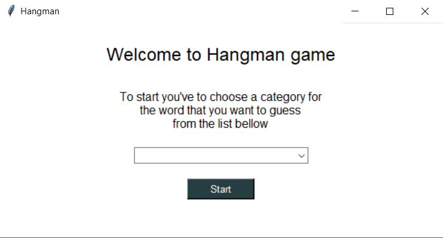
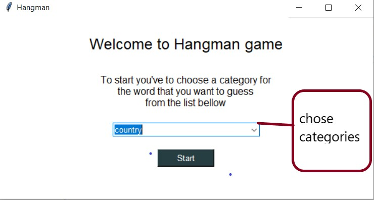
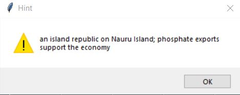
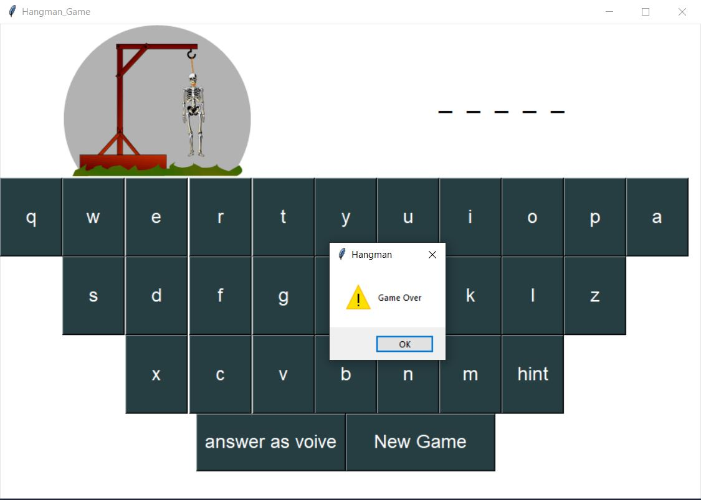

## INSTRUCTIONS

Guess letters one at a time to solve the word puzzle. Click a letter to guess it, or just click on button to answer with your voice. Each time you solve a word, the balloons you save are added to your score.

### HANGMAN TIPS AND STRATEGIES

- Try guessing the vowels - A good strategy is to begin by guessing a few vowels. With only five vowels in the English alphabet, you’ll quickly fill up those blanks without losing too many balloons.

- **_"Etaoin shrdlu"_** - **_"Etaoin shrdlu"_** isn’t a phrase from a foreign language. It’s just a list of the most common letters used in English, in order of frequency. "E" is the most commonly used letter, "t" is second-most common, etc. So try guessing those letters first.

- Remember the category - During each round of hangman you'll want to use that hint to focus your guesses.

- Solve individual words - Sometimes you’re not solving for a word, but a phrase. Make sure you’re trying to solve each of the words individually and not just hyper-focusing on guessing the correct letters. If you’re able to solve even one word in the phrase, that word, combined with the tip at the top of the window, will greatly increase your chances of winning that round of hangman.

- Don’t forget your Js and Zs - The letters J and Z always trip people up. They’re both fairly rare and it’s not always obvious when you need one to complete a word or phrase. Don’t guess a Z or a J at the very beginning, but keep them in mind as you play.

### WHAT DO YOU LEARN FROM PLAYING HANGMAN

> Hangman teaches you spelling, vocabulary, and other related language skills. Hangman can also help expand your topical knowledge.

## Game

_When you open the game you will see the home page as showen below_

_you should chose the type of the word you want to guess them_

_after that you should gess the word_

_you can git some help if you press on the Hint btn_

_you have 5 chance to guss the right charecter of you will lose_

